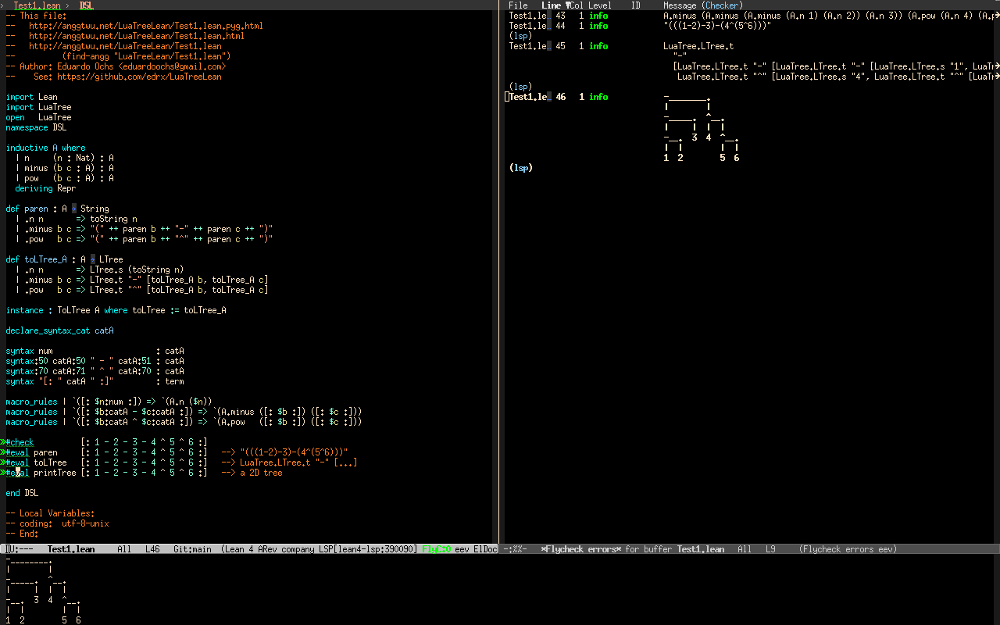

# Introduction

This is an attempt to port my [LuaTree](http://anggtwu.net/eev-maxima.html#luatree) thing from Maxima to Lean.

Here are links to HTMLized versions of the main files, colorized by Pygments: 
[LuaTree.lean](http://anggtwu.net/LuaTreeLean/LuaTree.lean.pyg.html),
[Test1.lean](http://anggtwu.net/LuaTreeLean/Test1.lean.pyg.html),
[Test2.lean](http://anggtwu.net/LuaTreeLean/Test2.lean.pyg.html),
[luatree.lua](http://anggtwu.net/LuaTreeLean/luatree.lua.pyg.html).

You can test it with:

    • (eepitch-shell)
    • (eepitch-kill)
    • (eepitch-shell)
    # (find-fline "/tmp/LuaTreeLean/")
    rm -Rfv /tmp/LuaTreeLean/
    mkdir   /tmp/LuaTreeLean/
    cd      /tmp/LuaTreeLean/
    git clone https://github.com/edrx/LuaTreeLean .
    # (find-file "/tmp/LuaTreeLean/")
    # (find-file "/tmp/LuaTreeLean/Test1.lean")

The lines with bullets are explained [here](http://anggtwu.net/eepitch.html) - you can skip them. Note
that [luatree.lua](http://anggtwu.net/LuaTreeLean/luatree.lua.pyg.html) needs lua5.1.

My page about Lean is here: [Eev and Lean4](http://anggtwu.net/eev-lean4.html). But I'm a newcomer, and
this is my first program worth showing&#x2026;

*Status: pre-alpha!!!*

# A screenshot

I'm only using this library interactly in Emacs (in Debian). It looks
like this:

